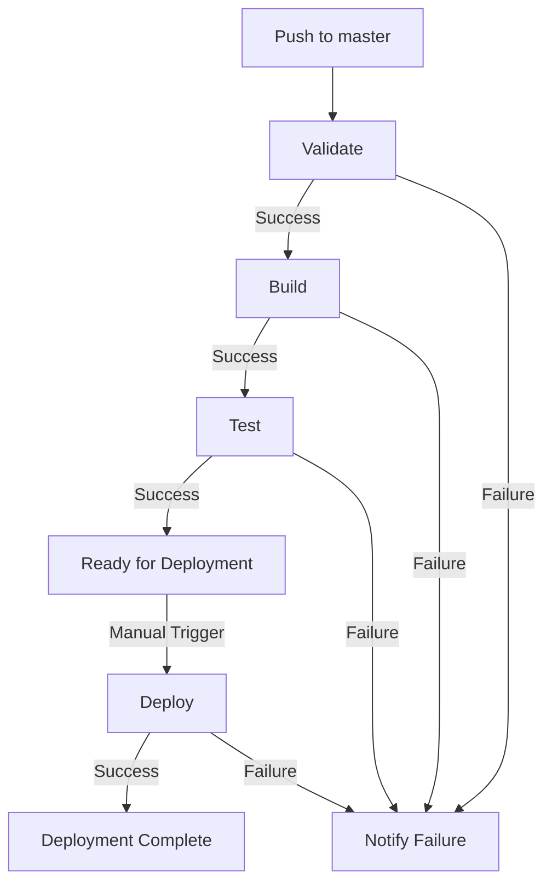
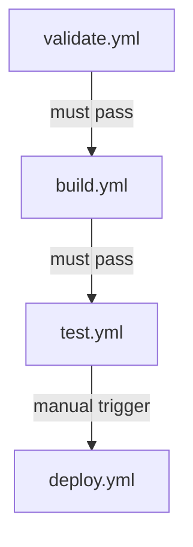

# NixOS Fabric CI/CD Pipeline

This document explains the CI/CD pipeline setup for the NixOS Fabric project.

## 📂 Pipeline Overview

The pipeline consists of 4 main workflows:

1. **Validate** - Syntax and basic configuration validation
2. **Build** - Full configuration builds
3. **Test** - Comprehensive configuration testing
4. **Deploy** - Deployment workflow (manual trigger)

## 🚀 Workflow Details

### 1. Validate Workflow (`validate.yml`)

**Trigger**: Push/Pull Request to master branch

**Purpose**: Quick validation of Nix configurations

**Steps**:
- Checkout repository with submodules
- Install Nix with cachix support
- Validate flake structure
- Test basic configuration evaluation
- Check for syntax errors

**Duration**: ~2-3 minutes

### 2. Build Workflow (`build.yml`)

**Trigger**: 
- Push/Pull Request to master
- After successful validation

**Purpose**: Full build of NixOS configurations

**Steps**:
- Build vm-sapinet configuration
- Build rtr-noisy configuration
- Cache build results
- List build artifacts

**Duration**: ~5-10 minutes

### 3. Test Workflow (`test.yml`)

**Trigger**:
- Push/Pull Request to master
- Daily at midnight (cron)

**Purpose**: Comprehensive configuration testing

**Tests**:
- WireGuard configuration
- FRR (BGP/OSPF) configuration
- Networking interfaces
- SSH configuration
- Firewall rules
- Undefined variables check

**Duration**: ~3-5 minutes

### 4. Deploy Workflow (`deploy.yml`)

**Trigger**: Manual (workflow_dispatch)

**Purpose**: Prepare deployment artifacts

**Inputs**:
- Target: vm-sapinet, rtr-noisy, or all
- Environment: production, staging, or development

**Steps**:
- Build selected configuration
- Prepare deployment artifacts
- Upload artifacts
- Notification

**Duration**: ~5-15 minutes (depending on target)

## 🔧 Setup Instructions

### Prerequisites

1. **GitHub Secrets** (optional but recommended):
   - `CACHIX_AUTH_TOKEN`: For Cachix caching
   - `SSH_PRIVATE_KEY`: For deployment (if automated)

2. **Cachix Cache** (recommended):
   ```bash
   # Create cachix cache
   cachix create nixos-fabric
   
   # Add to your system
   cachix use nixos-fabric
   
   # Add auth token to GitHub secrets
   cachix token
   ```

### Badges

Add these badges to your README.md:

```markdown
[](https://github.com/franck01081991/nixos-fabric/actions/workflows/validate.yml)
[](https://github.com/franck01081991/nixos-fabric/actions/workflows/build.yml)
[](https://github.com/franck01081991/nixos-fabric/actions/workflows/test.yml)
```

## 📊 Workflow Visualization



## 🛠️ Usage Examples

### Manual Deployment

```bash
# Trigger deployment via GitHub UI or API
curl -X POST \
  -H "Authorization: token YOUR_GITHUB_TOKEN" \
  -H "Accept: application/vnd.github.v3+json" \
  https://api.github.com/repos/franck01081991/nixos-fabric/actions/workflows/deploy.yml/dispatches \
  -d '{"ref":"master","inputs":{"target":"vm-sapinet","environment":"production"}}'
```

### Local Testing

```bash
# Test validation locally
nix flake check
nix eval .#nixosConfigurations.vm-sapinet.config.networking.hostName

# Test build locally
nix build .#nixosConfigurations.vm-sapinet.config.system.build.toplevel --no-link

# Test specific modules
nix eval .#nixosConfigurations.vm-sapinet.config.network-fabric.wireguard
```

## 🔄 Workflow Dependencies



## 📖 Best Practices

### 1. Commit Messages

Use clear commit messages that trigger appropriate workflows:
- `fix(config): Update networking module` - Triggers all workflows
- `docs: Update README` - Only triggers validation
- `feat: Add new module` - Triggers all workflows

### 2. Pull Requests

All pull requests to master will trigger:
- Validation workflow
- Build workflow (after validation)
- Test workflow (after build)

### 3. Branch Protection

Recommended branch protection rules:
- Require status checks to pass
- Require validation, build, and test workflows
- Require pull request reviews
- Require linear history

### 4. Caching

Use Cachix for faster builds:
```bash
# Push to cachix after local build
nix build .#nixosConfigurations.vm-sapinet.config.system.build.toplevel
cachix push nixos-fabric result
```

## 🛡️ Security

### Secrets Management

- Never commit secrets to repository
- Use GitHub secrets for sensitive data
- Rotate secrets regularly
- Use ephemeral tokens for deployment

### Deployment Security

- Use SSH keys with passphrases
- Restrict deployment to specific IPs
- Use short-lived certificates
- Enable audit logging

## 📊 Monitoring

### Workflow Monitoring

Monitor workflows at:
https://github.com/franck01081991/nixos-fabric/actions

### Notifications

Set up notifications in GitHub:
1. Go to repository Settings
2. Notifications
3. Custom routing
4. Add your email/Slack webhook

## 🔧 Troubleshooting

### Common Issues

**Issue**: Workflow fails on "Install Nix"
**Solution**: Check GitHub Actions runner availability

**Issue**: Build fails with "attribute not found"
**Solution**: Check for typos in configuration files

**Issue**: Cachix authentication fails
**Solution**: Verify CACHIX_AUTH_TOKEN secret

**Issue**: Workflow stuck in queue
**Solution**: Check GitHub Actions quota

### Debugging

```bash
# Check workflow logs
gh run list --workflow=validate.yml

# View specific run
gh run view RUN_ID

# Download artifacts
gh run download RUN_ID
```

## 📈 Performance Optimization

### Caching Strategies

1. **Nix Store Cache**: Uses GitHub Actions cache
2. **Cachix Cache**: Binary cache for Nix builds
3. **Dependency Cache**: Automatic for Nixpkgs

### Parallelization

The pipeline is designed to:
- Run validation quickly (~2-3 min)
- Build in parallel where possible
- Cache intermediate results
- Only rebuild what's necessary

## 🎯 Future Enhancements

### Potential Improvements

1. **Automated Deployment**: SSH-based deployment to targets
2. **Rollback Mechanism**: Automatic rollback on failure
3. **Canary Deployments**: Gradual rollout to nodes
4. **Health Checks**: Post-deployment verification
5. **Slack Notifications**: Real-time alerts

### Implementation Ideas

```yaml
# Example: Add Slack notification
- name: Slack Notification
  if: always()
  uses: rtCamp/action-slack-notify@v2
  env:
    SLACK_WEBHOOK: ${{ secrets.SLACK_WEBHOOK }}
    SLACK_COLOR: ${{ job.status }}
    SLACK_TITLE: "NixOS Fabric ${{ github.workflow }}"
    SLACK_MESSAGE: "Status: ${{ job.status }}\nCommit: ${{ github.sha }}"
```

## 📚 References

- [GitHub Actions Documentation](https://docs.github.com/en/actions)
- [Nix Flakes Documentation](https://nixos.wiki/wiki/Flakes)
- [Cachix Documentation](https://cachix.org)
- [NixOS Module System](https://nixos.org/manual/nixos/stable/index.html#sec-writing-modules)

## 🤝 Contributing

Contributions to the pipeline are welcome:
1. Fork the repository
2. Create a feature branch
3. Make your changes
4. Test thoroughly
5. Submit a pull request

## 📜 License

This pipeline configuration is part of the NixOS Fabric project and is licensed under the MIT License.