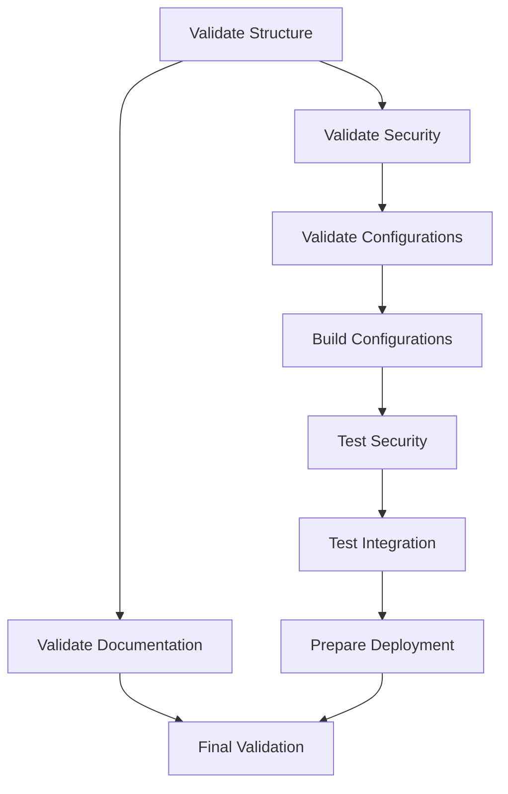
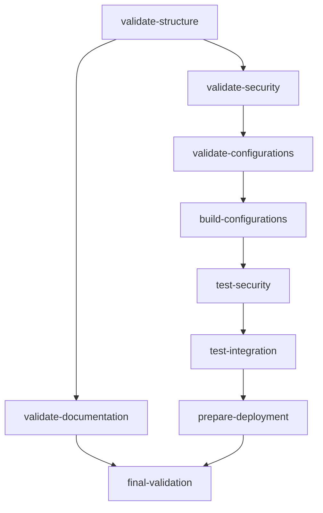

# NixOS Fabric CI/CD Pipeline Documentation

## Overview

The NixOS Fabric CI/CD pipeline is a comprehensive GitHub Actions workflow that validates, builds, tests, and prepares the NixOS Fabric configurations for deployment. It ensures code quality, security, and organization standards are maintained throughout the development process.

## Pipeline Structure



## Jobs Description

### 1. Validate Repository Structure

**Purpose**: Ensures the repository follows our organization and naming conventions.

**Checks**:
- Security module structure (`init.nix`, `default.nix`, `README.md`, etc.)
- Documentation files (`STRUCTURE.md`, `CONVENTIONS.md`, `CONTRIBUTING.md`)
- Test structure (`tests/run-organized-tests.sh`, `tests/modules/security/`)
- Flake structure validation

**Output**: Confirms repository organization is correct.

### 2. Validate Security Module

**Purpose**: Validates the security module syntax and basic functionality.

**Tests**:
- Security module syntax validation
- Basic configuration scenarios
- Example configuration validation
- Security test suite execution

**Output**: Confirms security module works correctly.

### 3. Validate Configurations

**Purpose**: Validates all host configurations compile correctly.

**Checks**:
- `rtr-sapinet` configuration
- `rtr-noisy` configuration
- `test-vm` configuration
- Security module enablement

**Output**: Confirms all configurations are syntactically correct.

### 4. Build Configurations

**Purpose**: Builds actual NixOS configurations to ensure deployability.

**Builds**:
- `rtr-sapinet` system configuration
- `rtr-noisy` system configuration
- `test-vm` system configuration

**Output**: Confirms all configurations can be built successfully.

### 5. Test Security Features

**Purpose**: Runs comprehensive security tests.

**Tests**:
- SSH configuration (port, authentication, etc.)
- Firewall configuration (rules, ports, etc.)
- Fail2ban configuration (jails, bans, etc.)
- System hardening (kernel parameters, etc.)

**Output**: Confirms security features work as expected.

### 6. Test Module Integration

**Purpose**: Tests integration between different modules.

**Tests**:
- Security + Networking integration
- Security + SSH integration
- Security + Fail2ban integration

**Output**: Confirms modules work well together.

### 7. Prepare Deployment

**Purpose**: Prepares deployment artifacts (master branch only).

**Actions**:
- Builds deployment artifacts
- Prepares artifact directory
- Uploads artifacts
- Creates deployment summary

**Output**: Deployment-ready artifacts and summary.

### 8. Validate Documentation

**Purpose**: Ensures documentation is complete and up-to-date.

**Checks**:
- Main documentation files
- Module documentation
- Example documentation
- Test documentation
- Documentation syntax
- TODO comments tracking

**Output**: Confirms documentation is complete.

### 9. Final Validation

**Purpose**: Final comprehensive validation.

**Actions**:
- Summarizes all validations
- Creates pipeline summary
- Uploads summary artifact

**Output**: Final confirmation that everything works.

## Pipeline Features

### Comprehensive Validation
- Validates repository structure and organization
- Tests security module with multiple scenarios
- Validates all host configurations
- Builds and tests all configurations

### Security Focus
- Dedicated security module testing
- Security feature validation
- Integration testing with security
- System hardening verification

### Quality Assurance
- Documentation completeness validation
- Code quality checks
- Configuration validation
- Build verification

### Deployment Ready
- Artifact preparation for production
- Deployment summary generation
- Artifact upload for easy deployment

### Clear Reporting
- Step-by-step validation
- Clear success/failure indicators
- Comprehensive pipeline summary
- Artifact upload for review

## Success Criteria

✅ **All jobs complete successfully**
✅ **No syntax errors in any configuration**
✅ **Security module works correctly**
✅ **All configurations can be built**
✅ **Documentation is complete**
✅ **Deployment artifacts are ready**

## Pipeline Execution

### Triggers
- **Push to master branch**: Runs full pipeline including deployment
- **Pull request to master**: Runs validation and testing (no deployment)

### Environment
- **Ubuntu latest**: Standard GitHub Actions runner
- **Nix with flakes**: Nix installation with flakes support
- **Cachix cache**: For faster builds

### Artifacts
- **nixos-fabric-configurations**: Deployment artifacts
- **pipeline-summary**: Pipeline execution summary

## Pipeline Configuration

### Environment Variables
```yaml
env:
  NIX_CONFIG: |
    experimental-features = nix-command flakes
    substituters = https://cache.nixos.org https://cachix.org
    trusted-public-keys = cache.nixos.org-1:6NCHdD59X431o0gWypbMrAURkbJ16ZPMQFGspcDShjY= cachix.org-1:3JSE1kY+J4t2T9K39c4cHQYWU96t8JX3lN5kXxp+20U=
```

### Job Dependencies


## Monitoring and Maintenance

### Pipeline Monitoring
- **GitHub Actions UI**: Visual interface for pipeline status
- **Email notifications**: For pipeline failures
- **Artifact download**: For deployment artifacts

### Maintenance Tasks
- **Update Nix version**: Periodically update Nix version
- **Add new tests**: As new features are added
- **Improve coverage**: Add more comprehensive tests
- **Optimize performance**: Reduce pipeline execution time

## Troubleshooting

### Common Issues

#### Pipeline Fails on Security Module
**Cause**: Syntax error or missing dependency
**Solution**: Check security module syntax with `nix-instantiate --eval`

#### Configuration Build Fails
**Cause**: Invalid configuration or missing options
**Solution**: Test configuration with `nix eval .#nixosConfigurations.host.config.option`

#### Documentation Validation Fails
**Cause**: Missing documentation files
**Solution**: Add required documentation following `CONVENTIONS.md`

### Debugging Commands

```bash
# Test security module locally
nix-instantiate --eval -E 'import ./modules/security/init.nix'

# Test specific configuration
nix eval .#nixosConfigurations.rtr-sapinet.config.networking.hostName

# Run organized tests locally
./tests/run-organized-tests.sh

# Check flake structure
nix flake check
```

## Best Practices

### Pipeline Development
1. **Test locally first**: Use `nix-instantiate` and `nix eval`
2. **Add incremental tests**: Start with basic validation
3. **Use clear job names**: Descriptive and action-oriented
4. **Document each job**: Explain purpose and checks
5. **Add meaningful output**: Helpful success/failure messages

### Pipeline Maintenance
1. **Monitor regularly**: Check pipeline execution
2. **Update dependencies**: Keep Nix and actions updated
3. **Add new tests**: For new features and modules
4. **Optimize execution**: Parallelize where possible
5. **Document changes**: Update this documentation

## Pipeline Evolution

### Future Improvements
- **Add more security tests**: Comprehensive security validation
- **Performance optimization**: Faster pipeline execution
- **Additional integration tests**: More module combinations
- **Automated documentation generation**: From code comments
- **Deployment automation**: Direct deployment to servers

### Version History
- **v1.0**: Initial pipeline with basic validation
- **v2.0**: Added security module testing
- **v3.0**: Added comprehensive documentation validation
- **v4.0**: Added deployment preparation and artifacts

## Contributing to the Pipeline

### Adding New Jobs
1. **Identify need**: What needs to be tested/validated
2. **Create job**: Follow existing job structure
3. **Add dependencies**: Connect to existing pipeline
4. **Test locally**: Verify job works correctly
5. **Document**: Add to this documentation

### Modifying Existing Jobs
1. **Understand current behavior**: Read job documentation
2. **Make small changes**: Incremental improvements
3. **Test thoroughly**: Verify changes work
4. **Update documentation**: Reflect changes
5. **Monitor**: Check pipeline execution

## Support

For pipeline issues and questions:
- **Check pipeline logs**: GitHub Actions UI
- **Review documentation**: This file and `CONVENTIONS.md`
- **Test locally**: Use provided debugging commands
- **Open issue**: For persistent problems

## License

The CI/CD pipeline is part of the NixOS Fabric project and is licensed under the MIT License. See `LICENSE` for details.