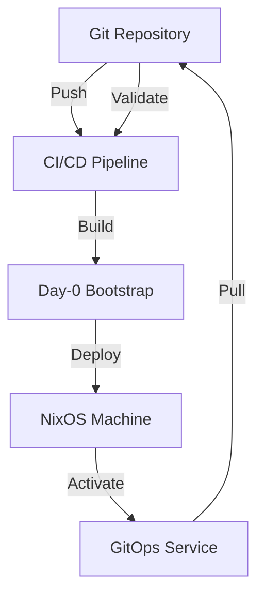
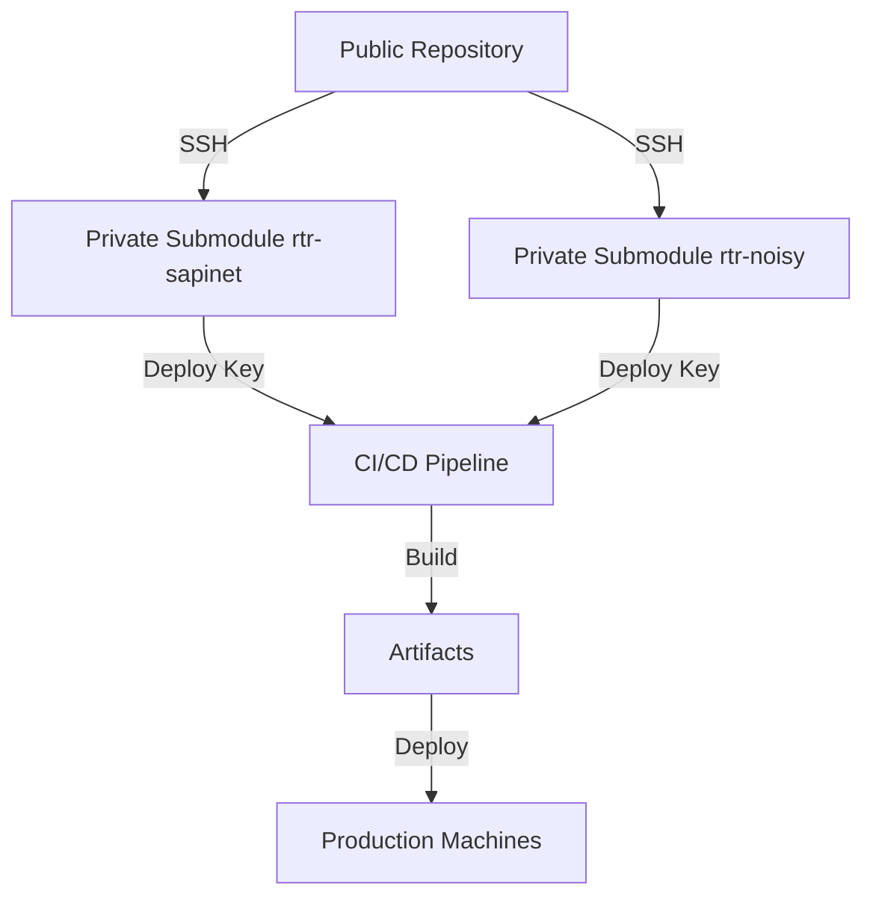
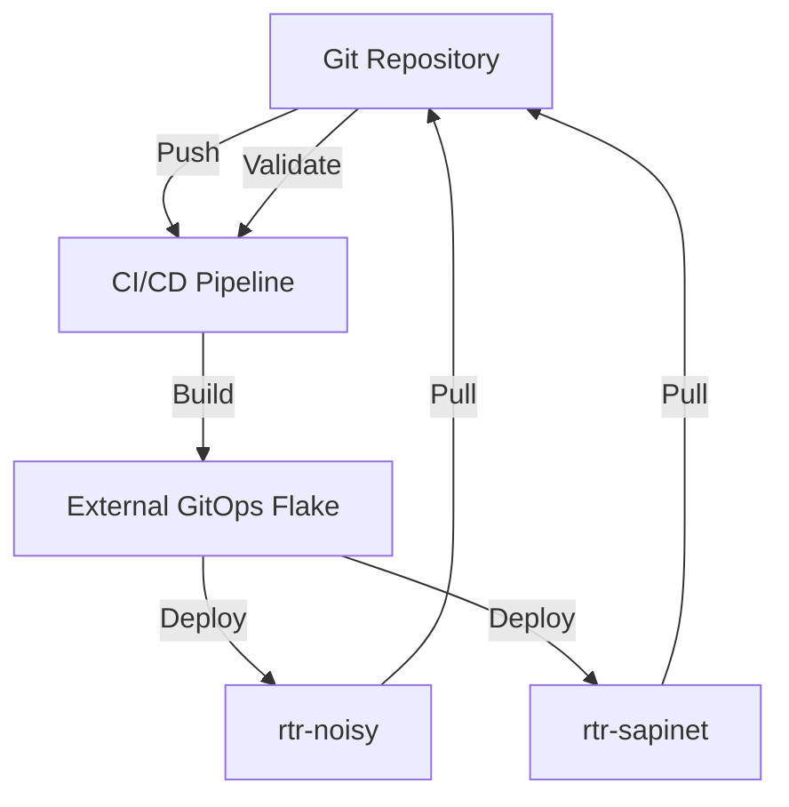

# NixOS Fabric GitOps Model

## 🎯 Overview

This repository implements a **pure GitOps model** for NixOS Fabric with two distinct phases:

- **Day-0 (Bootstrap)**: Initial deployment via CI/CD pipeline
- **Day-2 (Run)**: Machine pulls updates automatically from Git

## 🚀 Architecture



## 📁 Structure

```
gitops/
├── day-0/              # Day-0 Bootstrap Configuration
│   └── bootstrap-flake.nix  # Initial deployment flake
├── day-2/              # Day-2 GitOps Configuration
│   ├── gitops-flake.nix     # GitOps deployment flake
│   └── modules/             # GitOps modules
│       └── gitops.nix       # GitOps module definition
└── README.md            # This file
```

## 🔧 Day-0: Bootstrap Phase

### Purpose
Initial deployment of NixOS machines with minimal configuration to enable GitOps.

### Configuration
- **File**: `gitops/day-0/bootstrap-flake.nix`
- **Features**:
  - Basic system setup
  - SSH access
  - User configuration
  - Network setup
  - Fabric directory structure

### Deployment
1. **CI/CD Pipeline** builds the bootstrap configuration
2. **Artifacts** are created for deployment
3. **Deployment script** applies configuration to target machines

### Usage
```bash
# From CI/CD artifacts
./deploy.sh root@target-machine
```

## 🤖 Day-2: GitOps Phase

### Purpose
Enable continuous deployment where machines automatically pull and apply updates from Git.

### Configuration
- **File**: `gitops/day-2/gitops-flake.nix`
- **Module**: `gitops/modules/gitops.nix`
- **Features**:
  - Git repository tracking
  - Periodic update checks (every 15 minutes)
  - Automatic `nixos-rebuild` on changes
  - Systemd service and timer
  - Comprehensive logging

### Activation
```bash
# After Day-0 bootstrap
./activate-gitops.sh root@target-machine
```

### GitOps Service
- **Service**: `nixos-fabric-gitops.service`
- **Timer**: `nixos-fabric-gitops.timer` (every 15 minutes)
- **Log**: `/var/log/nixos-fabric/gitops.log`

## 🔄 CI/CD Pipeline

### Workflow
1. **Day-0 Bootstrap**: Build and validate initial configuration
2. **Day-2 GitOps**: Build and validate GitOps configuration
3. **Validation**: Comprehensive testing of all configurations
4. **Deployment**: Create artifacts and documentation

### Triggers
- **Push to master**: Full pipeline execution
- **Pull Request**: Validation only
- **Scheduled**: Hourly GitOps updates

### Artifacts
- `nixos-fabric-bootstrap`: Day-0 deployment package
- `nixos-fabric-gitops`: Day-2 GitOps package
- `nixos-fabric-complete-deployment`: Full deployment package

## 🔒 Private Submodules Configuration

### Overview

The external machine configurations are stored in **private GitHub repositories** as submodules:

- `external/rtr-sapinet-config` - Private repository
- `external/rtr-noisy-config` - Private repository

### Security Architecture



### Setup Instructions

#### 1. Create Private Repositories

```bash
# On GitHub, create two private repositories:
# - rtr-sapinet-config
# - rtr-noisy-config

# Clone them locally
git clone git@github.com:your-org/rtr-sapinet-config.git
git clone git@github.com:your-org/rtr-noisy-config.git

# Add existing configurations to each repository
cd rtr-sapinet-config
git add .
git commit -m "Initial configuration"
git push origin master

cd ../rtr-noisy-config
git add .
git commit -m "Initial configuration"
git push origin master
```

#### 2. Configure Submodules

```bash
# In the main repository
git submodule add git@github.com:your-org/rtr-sapinet-config.git external/rtr-sapinet-config
git submodule add git@github.com:your-org/rtr-noisy-config.git external/rtr-noisy-config

# Update .gitmodules to use SSH
git submodule sync
```

#### 3. Set Repository Visibility

```bash
# On GitHub:
# 1. Go to each repository settings
# 2. Set visibility to "Private"
# 3. Add collaborators as needed
# 4. Configure branch protection rules
```

#### 4. CI/CD Configuration

```bash
# On GitHub for the main repository:
# 1. Go to Settings > Secrets > Actions
# 2. Add new repository secret:
#    - Name: SSH_DEPLOY_KEY
#    - Value: Private SSH deploy key (read-only)
# 3. The secret will be used by the CI/CD pipeline
```

#### 5. Generate SSH Deploy Key

```bash
# Generate a new SSH key for CI/CD
ssh-keygen -t ed25519 -C "ci-cd-deploy-key" -f ci-cd-key

# Add the public key as a deploy key to both private repositories
# On GitHub for each private repository:
# 1. Go to Settings > Deploy keys
# 2. Add deploy key
# 3. Paste the public key content
# 4. Check "Allow write access" (optional)
# 5. Click "Add key"

# Add the private key as a secret to the main repository
# The private key content goes into SSH_DEPLOY_KEY secret
```

### Access Control

#### Repository Access Matrix

| Repository | Visibility | Access | Purpose |
|------------|------------|--------|---------|
| nixos-fabric | Public | Read | Main repository, CI/CD pipeline |
| rtr-sapinet-config | Private | Read (Deploy Key) | Spine router configuration |
| rtr-noisy-config | Private | Read (Deploy Key) | Hybrid router configuration |

#### CI/CD Access

- **SSH Deploy Key**: Read-only access to private submodules
- **GitHub Token**: Read/write access to main repository
- **Artifacts**: Publicly accessible deployment packages

### Best Practices

#### Security
- **Rotate deploy keys**: Every 90 days
- **Audit access**: Monthly review of repository access
- **Minimal permissions**: Deploy keys should be read-only
- **Branch protection**: Enable on all repositories

#### Configuration Management
- **Sensitive data**: Never commit secrets to any repository
- **Environment variables**: Use GitHub secrets for CI/CD
- **Access logs**: Monitor SSH key usage
- **IP restrictions**: Consider adding for deploy keys

## 🛡️ Security

### Bootstrap Phase
- Temporary SSH access with root login
- Basic security hardening
- Minimal attack surface

### GitOps Phase
- Read-only Git access via deploy keys
- Automatic security updates
- Comprehensive logging
- Service isolation

## 📊 Monitoring

### Day-0 Verification
```bash
# Check bootstrap status
ssh root@target-machine "cat /etc/nixos-fabric/bootstrap/completed"

# Verify fabric directories
ssh root@target-machine "ls -la /etc/nixos-fabric/"
```

### Day-2 Monitoring
```bash
# Check GitOps service status
ssh root@target-machine "systemctl status nixos-fabric-gitops"

# View GitOps logs
ssh root@target-machine "journalctl -u nixos-fabric-gitops -f"

# Check timer status
ssh root@target-machine "systemctl list-timers | grep gitops"
```

### External Machines Monitoring
```bash
# Check external machines GitOps status
ssh root@rtr-noisy "systemctl status nixos-fabric-gitops-external"
ssh root@rtr-sapinet "systemctl status nixos-fabric-gitops-external"

# View external machines GitOps logs
ssh root@rtr-noisy "journalctl -u nixos-fabric-gitops-external -f"
ssh root@rtr-sapinet "journalctl -u nixos-fabric-gitops-external -f"

# Check external machines timer status
ssh root@rtr-noisy "systemctl list-timers | grep gitops"
ssh root@rtr-sapinet "systemctl list-timers | grep gitops"

# Check external machines configuration
ssh root@rtr-noisy "cat /etc/nixos-fabric/gitops/machines/rtr-noisy"
ssh root@rtr-sapinet "cat /etc/nixos-fabric/gitops/machines/rtr-sapinet"
```

## 🔧 Customization

### Repository Configuration
Edit `gitops/day-2/gitops-flake.nix`:
```nix
network-fabric.gitops = {
  enable = true;
  repository = "git@github.com:your-org/nixos-fabric.git";
  branch = "main";  # or "production"
  interval = "15m"; # or "30m", "1h", etc.
  logFile = "/var/log/nixos-fabric/gitops.log";
};
```

### Update Frequency
Modify the `interval` parameter:
- `"15m"`: Every 15 minutes
- `"30m"`: Every 30 minutes  
- `"1h"`: Every hour
- `"*-*-* *:0/6:00"`: Every 6 hours

## 🌐 External Machines Integration

### Overview

The GitOps model integrates with existing external machine configurations located in the `external/` directory:

- **rtr-noisy**: Hybrid router configuration
- **rtr-sapinet**: Spine router configuration

### Integration Architecture



### Configuration Files

- **`gitops/external/flake.nix`**: Main flake for external machines
- **`gitops/external-integration.nix`**: Integration module
- **`external/rtr-noisy-config/default.nix`**: rtr-noisy base configuration
- **`external/rtr-sapinet-config/default.nix`**: rtr-sapinet base configuration
- **`hosts/default-ansible.nix`**: Ansible variables

### External Machines Configuration

```nix
# gitops/external/flake.nix
{
  description = "NixOS Fabric - External Machines GitOps Flake";

  inputs = {
    nixpkgs.url = "github:NixOS/nixpkgs/nixos-unstable";
  };

  outputs = { self, nixpkgs, ... }:
    let
      system = "x86_64-linux";
      pkgs = import nixpkgs { inherit system; };
    in
    {
      nixosConfigurations = {
        # Individual machine configurations
        rtr-noisy-gitops = nixpkgs.lib.nixosSystem {
          inherit system;
          modules = [
            ({ config, pkgs, ... }: {
              imports = [
                ./external-integration.nix
                ../external/rtr-noisy-config/default.nix
                ../hosts/default-ansible.nix
                ./modules/gitops.nix
              ];

              # Machine-specific settings
              network-fabric.gitops.machines."rtr-noisy".enable = true;
              networking.hostName = "rtr-noisy";
            })
          ];
        };

        # Combined configuration for all external machines
        external-gitops = nixpkgs.lib.nixosSystem {
          inherit system;
          modules = [
            ({ config, pkgs, ... }: {
              imports = [
                ./external-integration.nix
                ./modules/gitops.nix
              ];

              network-fabric.gitops = {
                enable = true;
                machines = {
                  "rtr-noisy" = {
                    enable = true;
                    configPath = "external/rtr-noisy-config/default.nix";
                  };
                  "rtr-sapinet" = {
                    enable = true;
                    configPath = "external/rtr-sapinet-config/default.nix";
                  };
                };
              };
            })
          ];
        };
      };
    };
}
```

## 🚀 Getting Started

### 1. Initial Setup
```bash
# Clone repository
git clone git@github.com:your-org/nixos-fabric.git
cd nixos-fabric

# Customize configurations
vim gitops/day-0/bootstrap-flake.nix
vim gitops/day-2/gitops-flake.nix
vim gitops/external/flake.nix

# Commit changes
git add .
git commit -m "Initial GitOps setup"
git push origin master
```

### 2. Deploy Day-0
1. Wait for CI/CD pipeline to complete
2. Download `nixos-fabric-complete-deployment` artifact
3. Run deployment script:
```bash
./deploy.sh root@target-machine
```

### 3. Activate Day-2
```bash
./activate-gitops.sh root@target-machine
```

### 4. Verify GitOps
```bash
# Check service status
ssh root@target-machine "systemctl status nixos-fabric-gitops"

# Monitor logs
ssh root@target-machine "tail -f /var/log/nixos-fabric/gitops.log"
```

### 5. Deploy to External Machines

```bash
# After CI/CD pipeline completes, download the deployment package
# Then deploy to individual machines:

# Deploy to rtr-noisy
./deploy-rtr-noisy.sh root@rtr-noisy

# Deploy to rtr-sapinet
./deploy-rtr-sapinet.sh root@rtr-sapinet

# Or deploy to all external machines at once
./deploy-all-external.sh
```

### 6. Verify External Machines GitOps

```bash
# Check external GitOps service status
ssh root@rtr-noisy "systemctl status nixos-fabric-gitops-external"
ssh root@rtr-sapinet "systemctl status nixos-fabric-gitops-external"

# Monitor external GitOps logs
ssh root@rtr-noisy "journalctl -u nixos-fabric-gitops-external -f"
ssh root@rtr-sapinet "journalctl -u nixos-fabric-gitops-external -f"

# Check timer status
ssh root@rtr-noisy "systemctl list-timers | grep gitops"
ssh root@rtr-sapinet "systemctl list-timers | grep gitops"
```

## 🎓 Best Practices

### Configuration Management
- **Small, frequent commits**: Easier to validate and deploy
- **Feature branches**: Test changes before merging to master
- **Pull requests**: Always validate before merging
- **Semantic versioning**: Tag releases appropriately

### Security
- **Rotate deploy keys**: Regularly update Git deploy keys
- **Monitor access**: Check SSH access logs
- **Audit changes**: Review all configuration changes
- **Backup configurations**: Before major updates

### Monitoring
- **Alert on failures**: Set up monitoring for GitOps service
- **Log retention**: Configure log rotation
- **Health checks**: Regular verification of machine status
- **Rollback plan**: Have a backup configuration ready

## 🔍 Troubleshooting

### Bootstrap Issues
- **SSH connection failed**: Verify network and credentials
- **Build errors**: Check CI/CD logs for details
- **Permission issues**: Ensure proper directory permissions

### GitOps Issues
- **Service not starting**: Check systemd logs
- **Pull failures**: Verify Git repository access
- **Rebuild failures**: Check configuration syntax
- **Timer not triggering**: Verify systemd timer status

### External Machines Issues
- **External service not starting**: Check external GitOps service logs
- **Machine configuration not found**: Verify configPath in GitOps settings
- **Integration failures**: Check external-integration.nix imports
- **Permission issues**: Verify /etc/nixos-fabric/gitops/machines permissions

### External Machines Commands
```bash
# Restart external GitOps service
ssh root@rtr-noisy "systemctl restart nixos-fabric-gitops-external"
ssh root@rtr-sapinet "systemctl restart nixos-fabric-gitops-external"

# Manual update trigger for external machines
ssh root@rtr-noisy "systemctl start nixos-fabric-gitops-external.service"
ssh root@rtr-sapinet "systemctl start nixos-fabric-gitops-external.service"

# Check last update for external machines
ssh root@rtr-noisy "cat /etc/nixos-fabric/gitops/last-update"
ssh root@rtr-sapinet "cat /etc/nixos-fabric/gitops/last-update"

# Force rebuild on external machines
ssh root@rtr-noisy "nixos-rebuild switch"
ssh root@rtr-sapinet "nixos-rebuild switch"
```

### Common Commands
```bash
# Restart GitOps service
ssh root@target-machine "systemctl restart nixos-fabric-gitops"

# Manual update trigger
ssh root@target-machine "systemctl start nixos-fabric-gitops.service"

# Check last update
ssh root@target-machine "cat /etc/nixos-fabric/gitops/last-update"

# Force rebuild
ssh root@target-machine "nixos-rebuild switch"
```

## 📚 Resources

### NixOS Documentation
- [NixOS Manual](https://nixos.org/manual/)
- [Nix Flakes](https://nixos.wiki/wiki/Flakes)
- [NixOps](https://nixos.wiki/wiki/NixOps)

### GitOps Resources
- [GitOps Principles](https://www.gitops.tech/)
- [Flux CD](https://fluxcd.io/)
- [Argo CD](https://argoproj.github.io/cd/)

### NixOS Fabric
- [Official Documentation](https://github.com/your-org/nixos-fabric)
- [Examples](https://github.com/your-org/nixos-fabric/tree/master/examples)
- [Modules Reference](https://github.com/your-org/nixos-fabric/tree/master/modules)

## 🤝 Contributing

### Development Workflow
1. Create feature branch
2. Make changes
3. Test locally
4. Submit pull request
5. Wait for CI/CD validation
6. Merge to master

### Testing
```bash
# Test bootstrap configuration
nix build ./gitops/day-0#bootstrap

# Test GitOps configuration
nix build ./gitops/day-2#gitops

# Test external machines configurations
nix build ./gitops/external#rtr-noisy-gitops
nix build ./gitops/external#rtr-sapinet-gitops
nix build ./gitops/external#external-gitops

# Validate flakes
nix flake check ./gitops/day-0
nix flake check ./gitops/day-2
nix flake check ./gitops/external

# Test external configurations
nix eval ./gitops/external#rtr-noisy-gitops.config.networking.hostName
nix eval ./gitops/external#rtr-sapinet-gitops.config.networking.hostName
```

### Local Development
```bash
# Enter development shell
nix develop

# Build specific configuration
nix build .#nixosConfigurations.bootstrap
nix build .#nixosConfigurations.gitops
nix build ./gitops/external#rtr-noisy-gitops
nix build ./gitops/external#rtr-sapinet-gitops
nix build ./gitops/external#external-gitops

# Test external configurations locally
nix eval ./gitops/external#rtr-noisy-gitops.config.network-fabric.gitops.machines.rtr-noisy.enable
nix eval ./gitops/external#rtr-sapinet-gitops.config.network-fabric.gitops.machines.rtr-sapinet.enable
```

## 📝 License

This project is licensed under the MIT License. See [LICENSE](LICENSE) for details.

## 🙏 Acknowledgments

- NixOS community for the excellent infrastructure
- GitOps community for deployment best practices
- All contributors who make this project possible

---

**NixOS Fabric GitOps** - Modern infrastructure deployment with NixOS and GitOps principles.