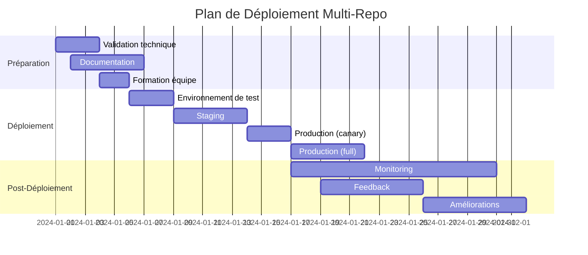

# Prochaines Étapes - Validation et Déploiement

Ce guide détaille les étapes à suivre pour valider et finaliser la migration multi-repo.

## 1. Validation Technique

### 1.1 Tester le Build Core

```bash
cd /home/franck/src/nixos-fabric-core

# Vérifier la structure du flake
nix flake check

# Exécuter les tests unitaires
nix build .#checks.x86_64-linux.unit-tests

# Entrer dans l'environnement de dev
nix develop
```

**Critères de succès:**
- ✅ `nix flake check` passe sans erreur
- ✅ Les tests unitaires s'exécutent avec succès
- ✅ L'environnement de dev se lance correctement

### 1.2 Tester le Build Fleet

```bash
cd /home/franck/src/nixos-fabric-fleet

# Vérifier la structure du flake
nix flake check

# Builder une configuration spécifique
nix build .#nixosConfigurations.rtr-prod-01

# Lister toutes les configurations disponibles
nix eval --raw .#nixosConfigurations | jq 'keys'
```

**Critères de succès:**
- ✅ `nix flake check` passe sans erreur
- ✅ Le build de `rtr-prod-01` réussit
- ✅ Toutes les configurations hôtes sont listées

### 1.3 Tester le Bootstrap (sur une VM)

```bash
# Créer une VM de test avec QEMU
qemu-img create -f qcow2 test-vm.qcow2 20G

# Bootstraper avec nixos-anywhere
nix run github:numtide/nixos-anywhere -- \
  --flake .#rtr-prod-01 \
  --disk /dev/vda \
  --extra-files ./test-vm.qcow2

# Ou sur une machine distante (si disponible)
nix run github:numtide/nixos-anywhere -- \
  --flake .#rtr-prod-01 \
  root@<test-machine-ip>
```

**Critères de succès:**
- ✅ La VM démarre avec la configuration attendue
- ✅ Les services sont opérationnels
- ✅ La configuration réseau est correcte

## 2. Validation GitOps

### 2.1 Tester le Profile GitOps

```bash
# Sur une machine de test déjà déployée:

# Copier le profile gitops
sudo cp /home/franck/src/nixos-fabric-fleet/profiles/gitops-pull.nix /etc/nixos/profiles/

# Appliquer la configuration
sudo nixos-rebuild switch --flake /home/franck/src/nixos-fabric-fleet#rtr-prod-01

# Vérifier que comin est actif
sudo systemctl status comin

# Vérifier le journal
sudo journalctl -u comin -f
```

**Critères de succès:**
- ✅ Le service comin est actif et en cours d'exécution
- ✅ Le journal montre des tentatives de pull réussies
- ✅ Les modifications dans le repo fleet déclenchent des mises à jour

### 2.2 Simuler une Mise à Jour

```bash
# Modifier un fichier dans fleet (ex: ajouter un commentaire)
cd /home/franck/src/nixos-fabric-fleet
echo "# Test update" >> hosts/production/rtr-prod-01.nix
git add . && git commit -m "Test update" && git push

# Sur la machine de test, vérifier que la mise à jour est détectée
sudo journalctl -u comin -f
```

**Critères de succès:**
- ✅ La modification est détectée par comin
- ✅ La reconstruction est déclenchée
- ✅ La machine redémarre si nécessaire

## 3. Validation des Secrets

### 3.1 Chiffrer les Secrets Réels

```bash
# Installer SOPS et age
nix-shell -p sops age

# Générer une clé age (si ce n'est pas déjà fait)
age-keygen -o ~/.config/sops/age/keys.txt

# Obtenir la clé publique
PUBLIC_KEY=$(cat ~/.config/sops/age/keys.txt | grep "public key" | awk '{print $3}')

# Chiffrer le fichier de secrets
cd /home/franck/src/nixos-fabric-secrets
sops --encrypt --age $PUBLIC_KEY secrets/production.yaml

# Mettre à jour .sops.yaml avec la vraie clé
sed -i "s/age1ql3c5q36q36q36q36q36q36q36q36q36q36q36q36q36q36q36q36q36q36q/$PUBLIC_KEY/" .sops.yaml

# Commit et push
git add . && git commit -m "Encrypt production secrets" && git push
```

**Critères de succès:**
- ✅ Le fichier est chiffré (contient `sops:`)
- ✅ Le déchiffrement fonctionne avec la clé privée
- ✅ Le fichier chiffré est poussé dans le repo

### 3.2 Intégrer SOPS dans Fleet

```bash
# Modifier fleet/flake.nix
cd /home/franck/src/nixos-fabric-fleet

# Ajouter sops-nix aux inputs
sed -i '/secrets.url/a\    sops-nix.url = "github:Mic92/sops-nix";' flake.nix

# Mettre à jour une configuration pour utiliser sops
# Dans flake.nix, ajouter sops-nix aux modules:
# modules = [
#   inputs.sops-nix.nixosModules.sops
#   {
#     sops.secrets = import inputs.secrets + "/secrets/production.yaml";
#   }
#   ...
# ];

# Tester le build
nix flake check
```

**Critères de succès:**
- ✅ Le flake se met à jour correctement
- ✅ Le build réussit avec sops-nix
- ✅ Les secrets sont accessibles dans la configuration

## 4. Validation CI/CD

### 4.1 Tester le Workflow Core

```bash
# Déclencher manuellement le workflow core
# Via l'interface GitHub ou avec gh CLI:
gh workflow run ci.yml --repo franck01081991/nixos-fabric-core
```

**Critères de succès:**
- ✅ Le workflow s'exécute avec succès
- ✅ Toutes les étapes passent (flake check, tests)
- ✅ Pas d'erreurs de linting ou de formatting

### 4.2 Tester le Workflow Fleet

```bash
# Déclencher le workflow de build
gh workflow run ci-cd.yml --repo franck01081991/nixos-fabric-fleet

# Tester le bootstrap manuel (avec une VM de test)
gh workflow run ci-cd.yml --repo franck01081991/nixos-fabric-fleet \
  -f hostname=rtr-prod-01 \
  -f target=<test-vm-ip>
```

**Critères de succès:**
- ✅ Le workflow de build réussit
- ✅ Le bootstrap manuel fonctionne (si testé)
- ✅ Les artefacts sont générés correctement

## 5. Documentation Finale

### 5.1 Finaliser les Guides

**Dans core/README.md:**
```markdown
## Guide de Release d'un Module

1. **Développement:**
   ```bash
   # Créer une branche de feature
   git checkout -b feat/nouveau-module
   
   # Développer le module dans modules/<domaine>/<module>.nix
   
   # Tester localement
   nix develop
   nix build .#checks.x86_64-linux.unit-tests
   ```

2. **Tests:**
   - Ajouter des tests unitaires dans tests/unit/
   - Vérifier que tous les tests passent

3. **Review:**
   - Créer une PR vers main
   - Obtenir au moins 1 approval
   - Merge avec squash

4. **Release:**
   ```bash
   # Tagger la nouvelle version
   git tag -a v1.1.0 -m "Add nouveau module"
   git push origin v1.1.0
   
   # Mettre à jour fleet pour utiliser la nouvelle version
   cd ../nixos-fabric-fleet
   nix flake lock --update-input core
   git add flake.lock && git commit -m "chore: update core to v1.1.0"
   ```
```

**Dans fleet/README.md:**
```markdown
## Guide d'Ajout d'un Hôte

1. **Créer la configuration:**
   ```bash
   # Copier un template
   cp hosts/production/rtr-prod-01.nix hosts/production/nouvel-hote.nix
   
   # Modifier la configuration
   # - networking.hostName
   # - networking.interfaces
   # - services spécifiques
   ```

2. **Ajouter au flake:**
   ```nix
   # Dans flake.nix
   nixosConfigurations."nouvel-hote" = nixpkgs.lib.nixosSystem {
     inherit system;
     modules = [
       nixosModules.fabric
       ./hosts/production/nouvel-hote.nix
       # Ajouter des profiles si nécessaire
       # ./profiles/gitops-pull.nix
     ];
   };
   ```

3. **Tester localement:**
   ```bash
   # Builder la configuration
   nix build .#nixosConfigurations.nouvel-hote
   
   # Tester avec une VM
   nix run github:numtide/nixos-anywhere -- \
     --flake .#nouvel-hote \
     root@<test-vm-ip>
   ```

4. **Déployer en production:**
   ```bash
   # Via CI/CD (recommandé)
   # 1. Commit et push
   git add hosts/production/nouvel-hote.nix flake.nix
   git commit -m "feat: add nouvel-hote"
   git push
   
   # 2. Déclencher le bootstrap via GitHub Actions
   # Ou manuellement:
   nix run github:numtide/nixos-anywhere -- \
     --flake .#nouvel-hote \
     root@<production-ip>
   ```

## Guide de Bootstrap Day-0

**Prérequis:**
- Machine cible avec IP accessible
- Accès SSH (port 22 par défaut)
- Connexion internet sur la cible

**Commande:**
```bash
nix run github:numtide/nixos-anywhere -- \
  --flake git+ssh://git@github.com/franck01081991/nixos-fabric-fleet#nouvel-hote \
  --option substituters "https://cache.nixos.org" \
  --option trusted-public-keys "cache.nixos.org-1:6NCHdD59X431o0gWypbMrAURkbJ16ZPMQFGspcDShjY=" \
  root@<target-ip>
```

**Dépannage:**
- **"Connection refused"**: Vérifier le firewall et que SSH est accessible
- **"No space left"**: Augmenter la taille du disque ou nettoyer
- **"Flake not found"**: Vérifier l'URL et que le repo est accessible
- **Timeout**: Vérifier la connectivité réseau et la stabilité
```
```

## 6. Plan de Déploiement Progressif

### 6.1 Stratégie Recommandée



### 6.2 Étapes Détaillées

**Phase 1: Validation (3-5 jours)**
- [ ] Tester tous les builds core et fleet
- [ ] Valider le bootstrap sur une VM
- [ ] Tester GitOps pull sur une machine de test
- [ ] Valider l'intégration des secrets
- [ ] Documenter les procédures

**Phase 2: Déploiement Staging (5 jours)**
- [ ] Déployer sur 1-2 machines de staging
- [ ] Monitorer les mises à jour GitOps
- [ ] Tester les rollbacks
- [ ] Valider les performances
- [ ] Corriger les problèmes identifiés

**Phase 3: Déploiement Production (Canary)**
- [ ] Sélectionner 1-2 machines non critiques
- [ ] Déployer avec la nouvelle architecture
- [ ] Monitorer pendant 48h
- [ ] Valider que les mises à jour fonctionnent
- [ ] Documenter les leçons apprises

**Phase 4: Déploiement Production (Full)**
- [ ] Planifier une fenêtre de maintenance
- [ ] Déployer sur toutes les machines
- [ ] Monitorer étroitement pendant 24h
- [ ] Être prêt pour les rollbacks
- [ ] Communiquer avec les parties prenantes

### 6.3 Checklist de Déploiement

**Avant le déploiement:**
- [ ] Tous les tests passent
- [ ] Documentation à jour
- [ ] Équipe formée
- [ ] Fenêtre de maintenance planifiée
- [ ] Procédure de rollback documentée

**Pendant le déploiement:**
- [ ] Monitorer les logs
- [ ] Vérifier la connectivité
- [ ] Valider les services
- [ ] Tester les mises à jour GitOps
- [ ] Documenter les problèmes

**Après le déploiement:**
- [ ] Monitorer pendant 48h
- [ ] Collecter les feedbacks
- [ ] Corriger les problèmes
- [ ] Mettre à jour la documentation
- [ ] Célébrer! 🎉

## 7. Procédures d'Urgence

### 7.1 Rollback d'un Hôte

```bash
# Rollback vers la génération précédente
ssh <hostname> "sudo nixos-rebuild switch --rollback"

# Vérifier l'état
ssh <hostname> "sudo nixos-rebuild list-generations"
```

### 7.2 Rollback Complet

```bash
# Script de rollback pour tous les hôtes
for host in $(nix eval --raw .#nixosConfigurations | jq -r 'keys[]'); do
  echo "Rolling back $host..."
  ssh $host "sudo nixos-rebuild switch --rollback" &
done
wait

# Vérifier l'état de tous les hôtes
for host in $(nix eval --raw .#nixosConfigurations | jq -r 'keys[]'); do
  echo "Status de $host:"
  ssh $host "sudo nixos-rebuild list-generations | head -5"
done
```

### 7.3 Retour au Monorepo

```bash
# Sur une machine individuelle
cd /tmp
git clone --branch monorepo-compat https://github.com/franck01081991/nixos-fabric.git
cd nixos-fabric
nixos-rebuild switch --flake .#<hostname>

# Pour toute la flotte (script)
for host in $(cat hosts-list.txt); do
  ssh $host "cd /tmp && git clone --branch monorepo-compat https://github.com/franck01081991/nixos-fabric.git && cd nixos-fabric && sudo nixos-rebuild switch --flake .#$host" &
done
```

## 8. Monitoring et Maintenance

### 8.1 Métriques Clés à Monitorer

```bash
# Sur chaque machine

# État du service comin
systemctl status comin

# Journal comin
journalctl -u comin -f

# Génération actuelle
nixos-rebuild list-generations

# État des services
systemctl status

# Utilisation disque
 df -h

# Connexions réseau
ss -tulnp
```

### 8.2 Alertes Recommandées

1. **Échec de comin**: Si le service comin échoue ou ne parvient pas à pull
2. **Échec de build**: Si une mise à jour échoue
3. **Espace disque faible**: Sur les machines déployées
4. **Connexion perdue**: Si une machine devient inaccessible
5. **Rollback automatique**: Si une génération échoue et rollback

### 8.3 Maintenance Routine

**Hebdomadaire:**
- Vérifier les mises à jour des dépendances flake
- Review des logs comin
- Test de rollback sur une machine

**Mensuelle:**
- Rotation des secrets
- Mise à jour des clés SOPS si nécessaire
- Review de la documentation

**Trimestrielle:**
- Audit de sécurité
- Review de l'architecture
- Planification des améliorations

## 9. Améliorations Futures

### 9.1 Court Terme (1-3 mois)

- [ ] Ajouter des tests d'intégration automatisés
- [ ] Implémenter des canary deployments
- [ ] Ajouter des métriques de déploiement
- [ ] Documenter les patterns de module

### 9.2 Moyen Terme (3-6 mois)

- [ ] Ajouter un tableau de bord de flotte
- [ ] Implémenter des health checks automatisés
- [ ] Ajouter des notifications de déploiement
- [ ] Automatiser la rotation des secrets

### 9.3 Long Terme (6-12 mois)

- [ ] Ajouter un système de feature flags
- [ ] Implémenter des blue-green deployments
- [ ] Ajouter un système de configuration dynamique
- [ ] Intégrer avec un système de monitoring centralisé

## 10. Ressources

### 10.1 Commandes Utiles

```bash
# Voir toutes les configurations disponibles
nix eval --raw .#nixosConfigurations | jq 'keys'

# Builder une configuration spécifique
nix build .#nixosConfigurations.<host>

# Mettre à jour une dépendance flake
nix flake lock --update-input <input>

# Voir les inputs disponibles
nix flake metadata

# Entrer dans un shell de dev
nix develop
```

### 10.2 Documentation

- **Nix Flakes**: https://nixos.wiki/wiki/Flakes
- **nixos-anywhere**: https://github.com/numtide/nixos-anywhere
- **comin**: https://github.com/ajs124/comin
- **SOPS**: https://github.com/mozilla/sops
- **sops-nix**: https://github.com/Mic92/sops-nix

### 10.3 Support

Pour les problèmes:
1. Vérifier les logs: `journalctl -u comin -f`
2. Consulter la documentation
3. Vérifier les issues GitHub
4. Demander de l'aide à l'équipe

## Conclusion

La migration vers une architecture multi-repo est une amélioration significative qui offre:

✅ **Meilleure séparation des responsabilités**
✅ **Déploiements plus fiables** avec GitOps
✅ **Sécurité améliorée** avec SOPS
✅ **Maintenabilité accrue** grâce à la modularité
✅ **Scalabilité** pour ajouter de nouveaux hôtes et modules

En suivant ce guide, vous devriez être en mesure de valider, déployer et maintenir la nouvelle architecture avec confiance. N'oubliez pas:

1. **Tester d'abord** sur des environnements non critiques
2. **Monitorer** étroitement pendant les déploiements
3. **Documenter** les problèmes et solutions
4. **Communiquer** avec l'équipe pendant la transition

Bonne migration! 🚀
