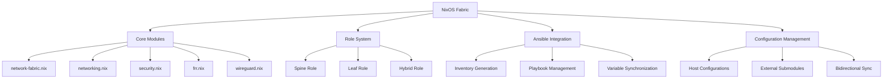
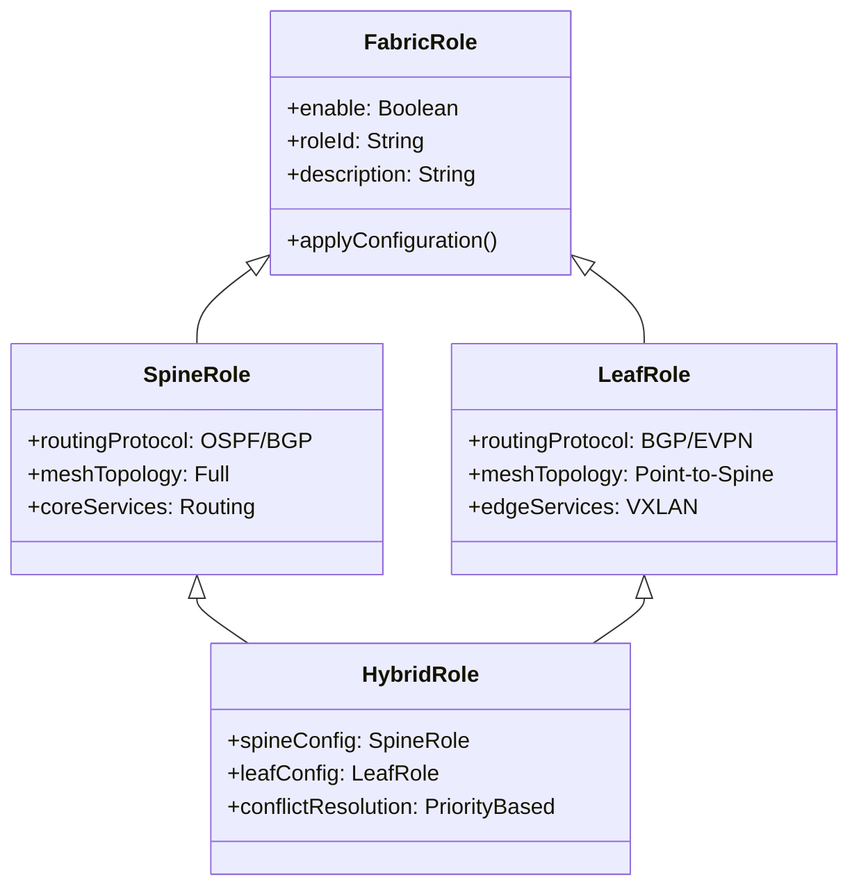
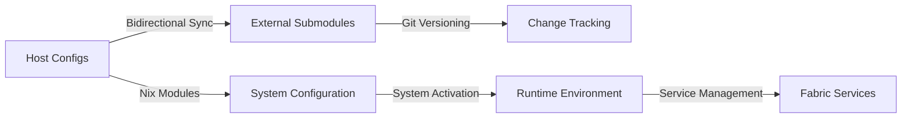
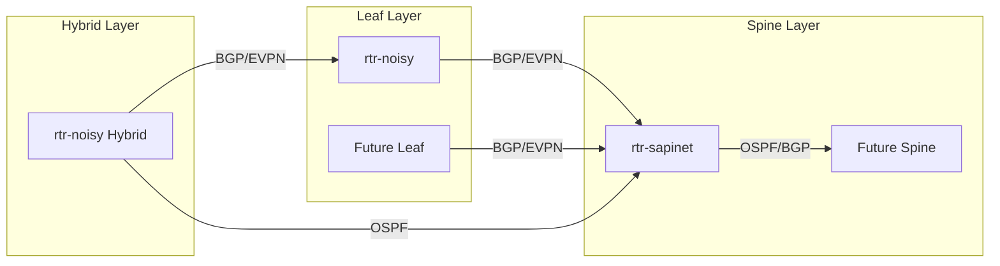
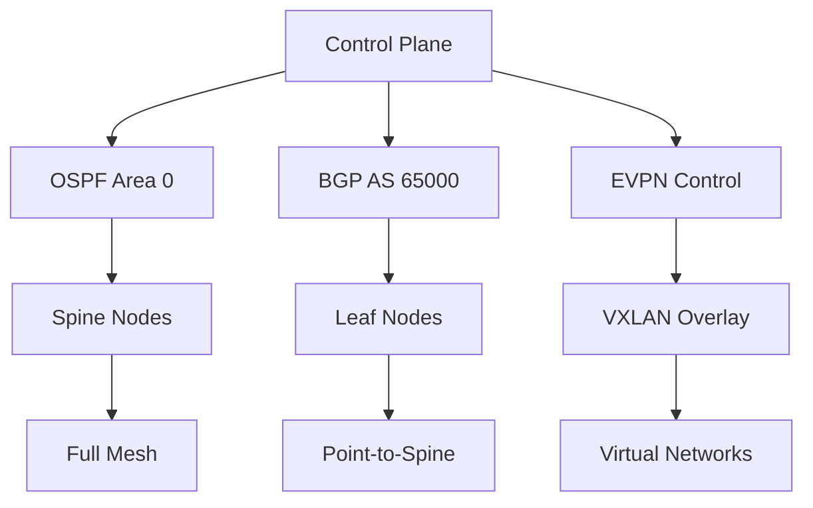
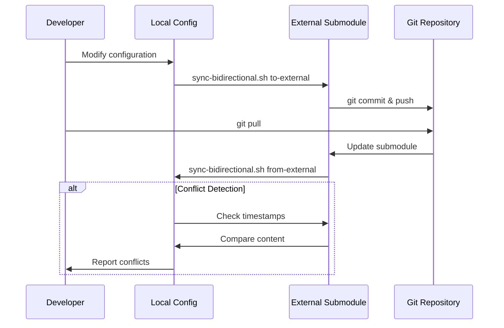
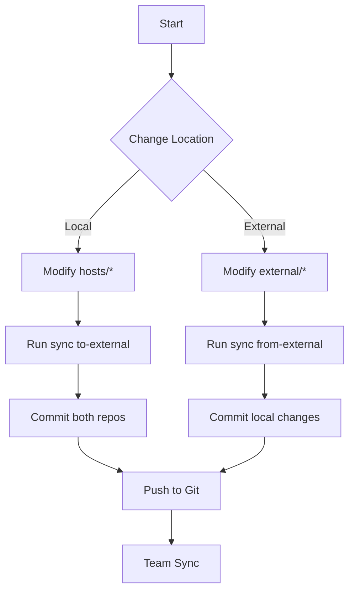
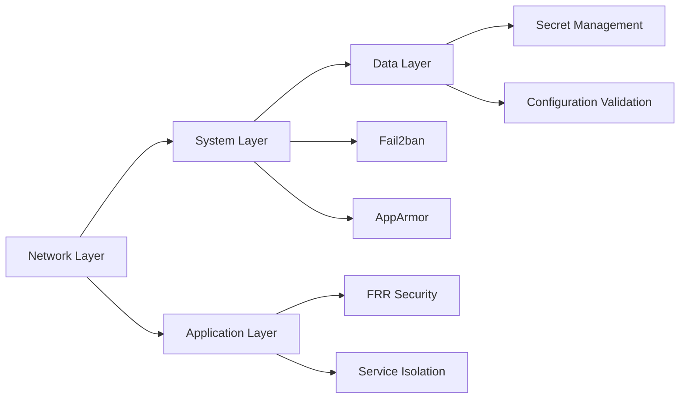
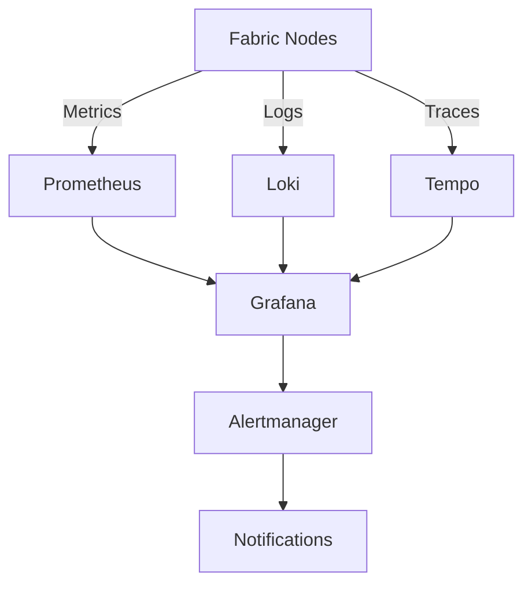
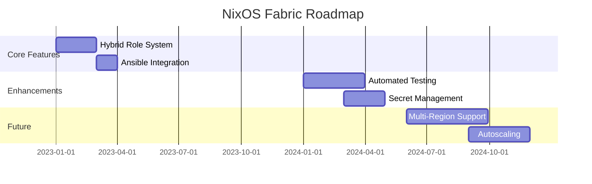

# NixOS Fabric Architecture - Comprehensive Guide

## 🎯 Overview

This document provides a comprehensive architectural overview of the NixOS Fabric system, explaining the design principles, component interactions, and deployment strategies.

## 🏗️ High-Level Architecture



## 🧩 Core Components

### 1. Central Fabric Module (`network-fabric.nix`)

The central module provides:
- **Unified Configuration Interface**: Single point for all fabric settings
- **Role Management**: Spine, Leaf, and Hybrid role definitions
- **Network Configuration**: IPv4/IPv6, DNS, routing
- **Security Settings**: SSH, firewall, access control
- **Environment Management**: Production/staging/development modes

### 2. Role System



### 3. Configuration Management Strategy



## 🔧 Technical Implementation

### Module Hierarchy

```
network-fabric.nix       # Central configuration
├── lib.nix              # Utility functions
├── dynamic.nix          # Runtime configuration
├── base.nix             # Common settings
├── networking.nix       # Network interfaces
├── security.nix         # Firewall & SSH
├── frr.nix              # Routing protocols
├── wireguard.nix        # VPN overlay
└── ansible.nix          # Configuration management
```

### Configuration Flow

1. **Nix Evaluation**: `flake.nix` → Module imports → Configuration merging
2. **System Activation**: Configuration → Activation scripts → Runtime environment
3. **Service Management**: systemd → Service configuration → Process supervision
4. **Runtime Configuration**: Environment variables → Service discovery → Dynamic updates

### Role-Based Configuration

```nix
# Example: Hybrid node configuration
{
  network-fabric.roles = {
    spine = {
      enable = true;
      roleId = "spine1";
      # OSPF + BGP configuration
    };
    leaf = {
      enable = true;
      roleId = "leaf1";
      # EVPN + VXLAN configuration
    };
  };
}
```

## 🌐 Network Topology

### Physical Topology



### Logical Topology



## 🔄 Synchronization Architecture

### Bidirectional Sync System



### Sync Workflow



## 🛡️ Security Architecture

### Security Layers



### Access Control Matrix

| Component | Access Level | Authentication | Encryption |
|-----------|--------------|----------------|------------|
| SSH | Admin | Key-based | AES-256 |
| WireGuard | Fabric | PSK | ChaCha20 |
| FRR | Service | None | None |
| Ansible | Admin | SSH Keys | SSH Tunnel |

## 🚀 Deployment Architecture

### Deployment Pipeline


### Deployment Strategies

1. **Blue-Green Deployment**: Parallel environments with instant switch
2. **Rolling Updates**: Gradual node-by-node updates
3. **Canary Releases**: Test on subset before full deployment
4. **A/B Testing**: Route traffic between versions

## 📊 Monitoring Architecture

### Monitoring Stack



### Key Metrics

- **Network**: Bandwidth, latency, packet loss
- **Routing**: OSPF neighbors, BGP sessions, route count
- **System**: CPU, memory, disk I/O
- **Services**: FRR status, WireGuard tunnels, SSH connections

## 🔧 Configuration Examples

### Hybrid Node Configuration

```nix
# hosts/rtr-noisy/default.nix
{
  network-fabric = {
    enable = true;
    name = "production-fabric";
    environment = "production";
    
    roles = {
      spine = {
        enable = true;
        roleId = "spine2";
      };
      leaf = {
        enable = true;
        roleId = "leaf1";
      };
    };
    
    network = {
      domain = "fabric.prod";
      dnsServers = [ "1.1.1.1" "8.8.8.8" ];
    };
  };
}
```

### Spine Node Configuration

```nix
# hosts/rtr-sapinet/default.nix
{
  network-fabric = {
    enable = true;
    name = "production-fabric";
    environment = "production";
    
    roles = {
      spine = {
        enable = true;
        roleId = "spine1";
      };
      leaf = {
        enable = false;
      };
    };
  };
}
```

## 🛠️ Best Practices

### Configuration Management

1. **Single Source of Truth**: Always modify in one location, sync to others
2. **Atomic Changes**: Make related changes together
3. **Validation**: Test configurations before deployment
4. **Documentation**: Document all non-obvious settings

### Role Configuration

1. **Clear Separation**: Keep spine/leaf configurations distinct
2. **Conflict Resolution**: Define priority for hybrid nodes
3. **Testing**: Validate role combinations before deployment
4. **Monitoring**: Monitor role-specific metrics

### Deployment

1. **Phased Rollouts**: Deploy to staging before production
2. **Rollback Plan**: Always have a fallback strategy
3. **Change Tracking**: Document all configuration changes
4. **Team Communication**: Coordinate deployments across team

## 📚 Reference Architecture

### Standard Fabric Configuration

```yaml
# Standard fabric configuration reference
fabric:
  name: "production-fabric"
  environment: "production"
  version: "25.11"
  
  roles:
    spine:
      count: 2-4
      protocol: "OSPF+BGP"
      topology: "full-mesh"
    leaf:
      count: "as-needed"
      protocol: "BGP+EVPN"
      topology: "point-to-spine"
  
  network:
    ipv4_prefix: "10.254.0.0/16"
    ipv6_prefix: "fd42:1337:254::/64"
    dns_servers: ["1.1.1.1", "8.8.8.8"]
  
  security:
    ssh_port: 22
    fail2ban: true
    firewall: true
```

## 🎯 Future Architecture Evolution

### Planned Enhancements

1. **Automated Testing**: CI/CD pipeline with validation
2. **Secret Management**: Integration with Vault/age
3. **Configuration Drift Detection**: Automated compliance checking
4. **Multi-Region Support**: Geographic distribution
5. **Autoscaling**: Dynamic node provisioning

### Roadmap



## 📖 Additional Resources

- [Deployment Guide](DEPLOYMENT.md): Step-by-step deployment instructions
- [Role System](ROLES.md): Detailed role configuration guide
- [Ansible Integration](ANSIBLE_INTEGRATION.md): Ansible workflow documentation
- [Troubleshooting Guide](TROUBLESHOOTING.md): Common issues and solutions

This architecture provides a flexible, scalable, and maintainable foundation for building advanced network fabrics with NixOS.